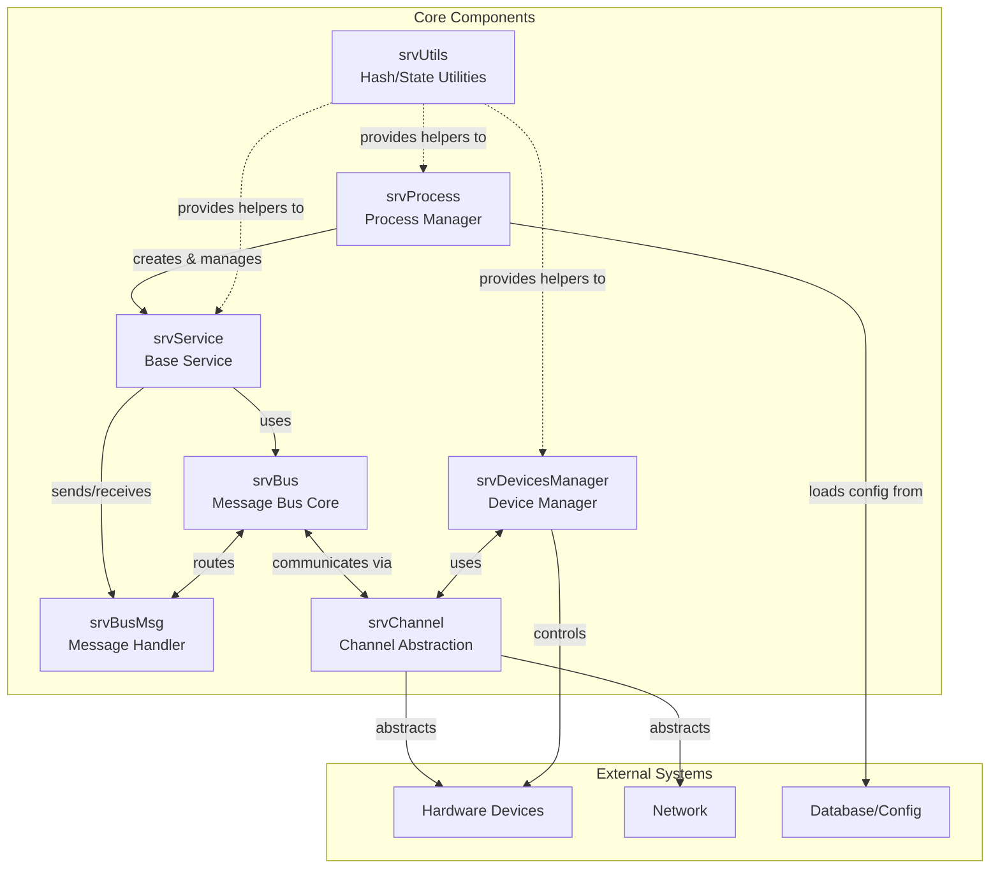

# Horizon Core Components

- [[srvProcess]] - Process management and orchestration
- [[decl/horizon/srvService]] - Base service framework
- [[decl/horizon/srvBus]] - Message bus core
- [[srvBusMsg]] - Bus message handling
- [[srvChannel]] - Communication channel abstraction
- [[srvUtils]] - Shared utilities (hash generation, state control)

```decl
module HorizonServer {
	core {
        srvProcess        // process management and orchestration
        srvService        // base service framework
        srvBus            // message bus core
        srvBusMsg         // bus message handling
        srvChannel        // communication channel abstraction
        srvUtils          // shared utilities (hash, state control)
        srvDevicesManager // device management
	}
}
```

## interaction diagram


