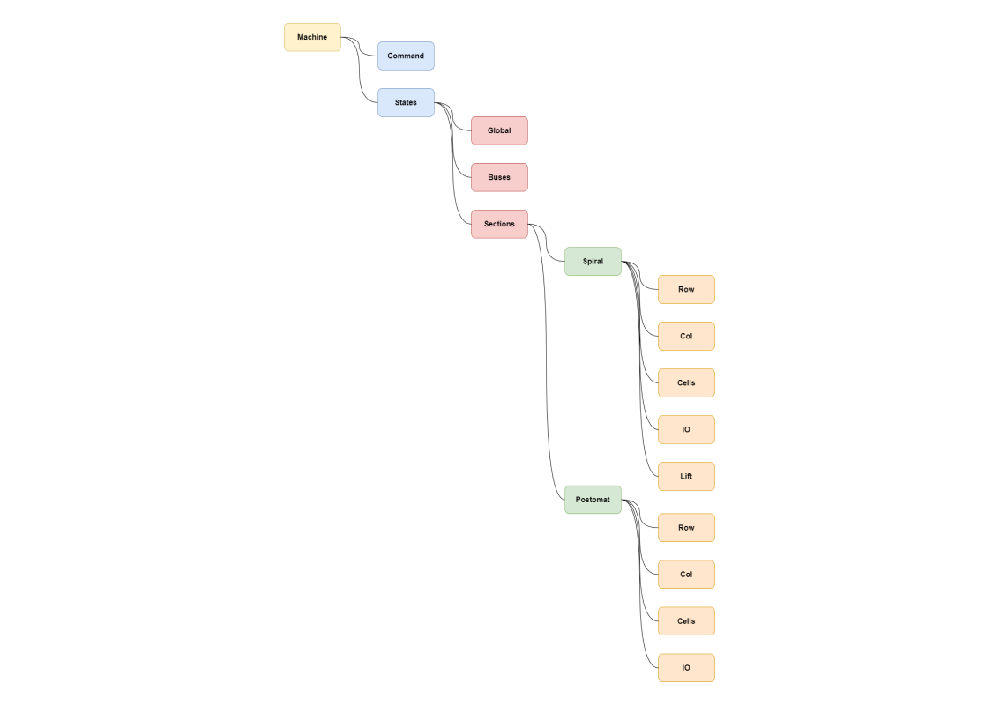

# Флаги состояния вендингового аппарата

```decl
// Флаги состояния вендингового аппарата
class State {}
```

В ответственность нижнего уровня входит отслеживания состояния системы и установления соответствующих флагов для его мониторинга. Флаги располагаются в древовидной структуре топиков MQTT, корневой для которых является ветка States:
<p align="left">
  
  <p style="text-align: center;">Схема-карта топиков MQTT</p>  
</p>

## [[Глобальные флаги состояния]]

Глобальные флаги состояния побликуются в топиках MQTT брокера по пути **States/Global/#** и имеют следующие значения:

| Global State            | Значения    | Расшифровка                             | Действия 
| :---------------------- | :---------- | :-------------------------------------- | :------- 
| **[[Global_Machine_States]]** | OK          | Аппарат работает в стандартном режиме   | - 
| -                       | SERVICE     | Аппарат находится в сервисном режиме    | Никакие бизнес команды при переходе в этот статус выполнятся не должны
| -                       | DEPLOY      | Обновление прошивки                     | Никакие бизнес команды при переходе в этот статус выполнятся не должны
| **[[Global_Input_Voltage]]**  | OK          | Входное напряжение в норме              | - 
| -                       | ERR_HIGH    | Входное напряжение повышено             | Выдать предупреждение о повышенном напряжении
| -                       | ERR_LOW     | Входное напряжение понижено             | Выдать предупреждение о пониженном напряжении 
| **[[Global_Env_Temp_Top]]**    | OK          | Температура на верхнем датчике в норме   | -
| -                       | ERR_HIGH    | Температура на первом датчике повышена  | Завершить текущую команду бизнес логики. Выключить все хабы, кроме **Hub-Low**
| -                       | ERR_LOW     | Температура на верхнем датчике понижена  | Выдать предупреждение о пониженной температуре
| **[[Global_Env_Hum_Top]]**     | OK          | Влажность на верхнем датчике в норме     | - 
| -                       | ERR_HIGH    | Влажность на верхнем датчике повышена    | Выдать предупреждение о повышенной влажности
| **[[Global_Env_Temp_Bottom]]**  | OK          | Температура на нижнем датчике в норме   | - 
| -                       | ERR_HIGH    | Температура на нижнем датчике повышена  | Завершить текущую команду бизнес логики. Выключить все хабы, кроме **Hub-Low**
| -                       | ERR_LOW     | Температура на нижнем датчике понижена  | Выдать предупреждение о пониженной температуре
| **[[Global_Env_Hum_Bottom]]**   | OK          | Влажность на нижнем датчике в норме     | - 
| -                       | ERR_HIGH    | Влажность на втором датчике повышена    | Выдать предупреждение о повышенной влажности
| **[[Global_Hub_Low_Net]]**    | ONLINE      | Хаб НУ доступен по сети                 | - 
| -                       | OFFLINE     | Хаб НУ недоступен по сети               | Реакция в разработке
| -                       | ERR_NO_LINK | Хаб НУ потерял соединение               | Реакция в разработке
| **[[Global_Hub_Mid_Net]]**    | ONLINE      | Хаб СУ доступен по сети                 | - 
| -                       | OFFLINE     | Хаб СУ недоступен по сети               | Реакция в разработке
| -                       | ERR_NO_LINK | Хаб СУ потерял соединение               | Реакция в разработке
| **[[Global_Hub_Hi_Net]]**     | ONLINE      | Хаб ВУ доступен по сети                 | - 
| -                       | OFFLINE     | Хаб ВУ недоступен по сети               | Реакция в разработке
| -                       | ERR_NO_LINK | Хаб ВУ потерял соединение               | Реакция в разработке
<div style="page-break-after: always;"></div>

## [[Флаги состояния ИП и шин]]

Флаги состояния шин побликуются в топиках **States/Buses/#** и имеют следующие значения:

| Buses State             | Значения    | Расшифровка                             | Действия 
| :---------------------- | :---------- | :-------------------------------------- | :------- 
| **Buses_Bus_1_Voltage**   | OK          | Напряжение на первой шине в норме       | - 
| -                       | ERR_HIGH    | Напряжение на первой шине повышено      | Выдать предупреждение о повышенном напряжении
| -                       | ERR_LOW     | Напряжение на первой шине понижено      | Выдать предупреждение о низком напряжении 
| **Buses_Bus_1_Current**   | OK          | Ток на первой шине в норме              | - 
| -                       | ERR_HIGH    | Ток на первой шине повышен              | Выдать предупреждение о повышенном токе
| **Buses_Bus_1_Temp**      | OK          | Температура на первой шины в норме      | - 
| -                       | ERR_HIGH    | Температура на первой шины повышена     | Выдать предупреждение о повышенной температуре
| -                       | ERR_LOW     | Температура на первой шины понижена     | Выдать предупреждение о пониженной температуре
| **Buses_Bus_2_Voltage**   | OK          | Напряжение на второй шине в норме       | - 
| -                       | ERR_HIGH    | Напряжение на второй шине повышено      | Выдать предупреждение о повышенном напряжении
| -                       | ERR_LOW     | Напряжение на второй шине понижено      | Выдать предупреждение о низком напряжении 
| **Buses_Bus_2_Current**   | OK          | Ток на второй шине в норме              | - 
| -                       | ERR_HIGH    | Ток на второй шине повышен              | Выдать предупреждение о повышенном токе
| **Buses_Bus_2_Temp**      | OK          | Температура на второй шины в норме      | - 
| -                       | ERR_HIGH    | Температура на второй шины повышена     | Выдать предупреждение о повышенной температуре
| -                       | ERR_LOW     | Температура на второй шины понижена     | Выдать предупреждение о пониженной температуре
| **Buses_Bus_3_Voltage**   | OK          | Напряжение на третьей шине в норме      | - 
| -                       | ERR_HIGH    | Напряжение на третьей шине повышено     | Выдать предупреждение о повышенном напряжении
| -                       | ERR_LOW     | Напряжение на третьей шине понижено     | Выдать предупреждение о низком напряжении 
| **Buses_Bus_3_Current**   | OK          | Ток на третьей шине в норме             | - 
| -                       | ERR_HIGH    | Ток на третьей шине повышен             | Выдать предупреждение о повышенном токе
| **Buses_Bus_3_Temp**      | OK          | Температура на третьей шины в норме     | - 
| -                       | ERR_HIGH    | Температура на третьей шины повышена    | Выдать предупреждение о повышенной температуре
| -                       | ERR_LOW     | Температура на третьей шины понижена    | Выдать предупреждение о пониженной температуре
| **Buses_Bus_4_Voltage**   | OK          | Напряжение на четвертой шине в норме    | - 
| -                       | ERR_HIGH    | Напряжение на четвертой шине повышено   | Выдать предупреждение о повышенном напряжении
| -                       | ERR_LOW     | Напряжение на четвертой шине понижено   | Выдать предупреждение о низком напряжении 
| **Buses_Bus_4_Current**   | OK          | Ток на четвертой шине в норме           | - 
| -                       | ERR_HIGH    | Ток на четвертой шине повышен           | Выдать предупреждение о повышенном токе
| **Buses_Bus_4_Temp**      | OK          | Температура на четвертой шине в норме   | - 
| -                       | ERR_HIGH    | Температура на четвертой шине повышена  | Выдать предупреждение о повышенной температуре
| -                       | ERR_LOW     | Температура на четвертой шине понижена  | Выдать предупреждение о пониженной температуре
| **Buses_Bus_5_Voltage**   | OK          | Напряжение на пятой шине в норме        | - 
| -                       | ERR_HIGH    | Напряжение на пятой шине повышено       | Выдать предупреждение о повышенном напряжении
| -                       | ERR_LOW     | Напряжение на пятой шине понижено       | Выдать предупреждение о низком напряжении 
| **Buses_Bus_5_Current**   | OK          | Ток на пятой шине в норме               | - 
| -                       | ERR_HIGH    | Ток на пятой шине повышен               | Выдать предупреждение о повышенном токе
| **Buses_Bus_5_Temp**      | OK          | Температура на пятой шине в норме       | - 
| -                       | ERR_HIGH    | Температура на пятой шине повышена      | Выдать предупреждение о повышенной температуре
| -                       | ERR_LOW     | Температура на пятой шине понижена      | Выдать предупреждение о пониженной температуре


## [[Флаги состояния секции]]

Флаги состояния секций публикуются в топиках **States/Sections/#**. Они деляться на две подгруппы: **/Spiral/#** и **/Postomat/#** и имеют следующие значения:

| Section State           | Значения    | Расшифровка                                        | Действия 
| :---------------------- | :---------- | :------------------------------------------------- | :------- 
| **Section_Spiral_State**  | OK          | Спиральная секция функционирует в штатном режиме   | - 
| -                       | BLOCKED     | Спиральная секция недоступна                       | Топик несёт справочный характер, причины недоступности необходимо смотреть по статусам ячеек и портов данной секции
| **Section_Postomat_State**| OK          | Постоматная секция функционирует в штатном режиме  | - 
| -                       | BLOCKED     | Постоматная секция недоступна                      | Топик несёт справочный характер, причины недоступности необходимо смотреть по статусам ячеек и портов данной секции
<div style="page-break-after: always;"></div>

## [[Флаги состояния строк и столбцов]]

Флаги состояния строк публикуются в топиках **States/Sections/{Spiral/Postomat}/Row/{Number}/#**, а столбцов в **States/Sections/{Spiral/Postomat}/Column/{Number}/#**. Топики несут справочный характер:

| Row/Col State           | Значения    | Расшифровка                                        | Действия 
| :---------------------- | :---------- | :------------------------------------------------- | :------- 
| **Spiral_Row_State**      | OK          | Строка спиральной секции работает                  | - 
| -                       | BLOCKED     | Строка спиральной секции недоступна                | Топик несёт справочный характер, причины недоступности необходимо смотреть по статусам ячеек и портов данной секции
| **Spiral_Col_State**      | OK          | Столбец спиральной секции работает                 | - 
| -                       | BLOCKED     | Столбец спиральной секции недоступна               | Топик несёт справочный характер, причины недоступности необходимо смотреть по статусам ячеек и портов данной секции
| **Postomat_Row_State**    | OK          | Строка постоматной секции работает                 | - 
| -                       | BLOCKED     | Строка постоматной секции недоступна               | Топик несёт справочный характер, причины недоступности необходимо смотреть по статусам ячеек и портов данной секции
| **Postomat_Col_State**    | OK          | Столбец постоматной секции работает                | - 
| -                       | BLOCKED     | Столбец постоматной секции недоступна              | Топик несёт справочный характер, причины недоступности необходимо смотреть по статусам ячеек и портов данной секции
<div style="page-break-after: always;"></div>

## [[Флаги состояния лифта]]

Флаги состояния лифта публикуются в топиках **States/Sections/Spiral/Lift/#** и имеют следующие значения:

| Lift State              | Значения               | Расшифровка                                        | Действия 
| :---------------------- | :--------------------- | :------------------------------------------------- | :------- 
| **Spiral_Lift_State**     | OK                     | Лифт функционирует в штатном режиме                | - 
| -                       | LIFT_SHORT_CIRCUIT     | На моторе лифта обнаружено короткое замыкание      | Прерываем выполнение команды бизнес логики, блокируем спиральную секцию
| -                       | LIFT_NO_POWER          | На моторе лифта отсутствует питание                | Прерываем выполнение команды бизнес логики, блокируем спиральную секцию
| -                       | LIFT_TAMPER_ERROR      | Тампрер лифта вышел из строя                       | Прерываем выполнение команды бизнес логики, блокируем спиральную секцию
| -                       | LIFT_LEVEL_ERROR       | Датчик уровня лифта не функционирует               | Прерываем выполнение команды бизнес логики, блокируем спиральную секцию

## [[Флаги состояния модулей ввода-вывода]]

Флаги состояния IO модулей публикуются в топике **States/Sections/{Spiral/Postomat}/IO/#** и имеют следующие значения:

| IO State          | Значения     | Расшифровка                                        | Действия 
| :---------------- | :----------- | :----------------------------------------- | :------- 
| **IO_State**      | OK           | IO-модуль секции работает                  | -
| -                 | ERR_NO_LINK  | Потеряно соединение с IO модулем секции    | Прерываем текущую транзакцию и бизнес команду
| **IO_Port_State** | OK           | Порт работает | - 
| -                 | ERROR        | Порт поврежден и неуправляем               | Завершаем выполнение текущей транзакции, прерываем выполнение бизнес команды, блокируем секцию
<div style="page-break-after: always;"></div>

## [[Флаги состояния ячеек]]

Флаги состояния ячеек публикуются в топике **States/Sections/{Spiral/Postomat}/Cells/#** и имеют следующие значения:

| Cells State                    | Значения               | Расшифровка                                        | Действия 
| :----------------------------- | :--------------------- | :------------------------------------------------- | :------- 
| **{Spiral/Postomat}_Cell_State** | OK                     | Ячейка функционирует в штатном режиме              | - 
| -                              | OVERLOAD               | Обнаружен повышенный ток                           | Продолжить выполнение транзакций указанной ячейки, продолжить выполнение бизнес-команды
| -                              | BLOCKED                | Ячейка функционирует, но недоступна                | Прервать выполнение транзакции, продолжить выполнение бизнес-команды
| -                              | SERVICE                | Ячейка в режиме обслуживания                       | Прервать выполнение транзакции, продолжить выполнение бизнес-команды
| -                              | TAMPER_ERROR           | Обноружено нестандартное поведение тампера         | Прервать выполнение транзакции, продолжить выполнение бизнес-команды
| -                              | ACTUATOR_SHORT_CIRCUIT | Обнаружено короткое замыкание                      | Прервать выполнение транзакции, продолжить выполнение бизнес-команды
| -                              | ACTUATOR_NO_POWER      | На моторе или замке ячейки нет напряжения          | Прервать выполнение транзакции, продолжить выполнение бизнес-команды

